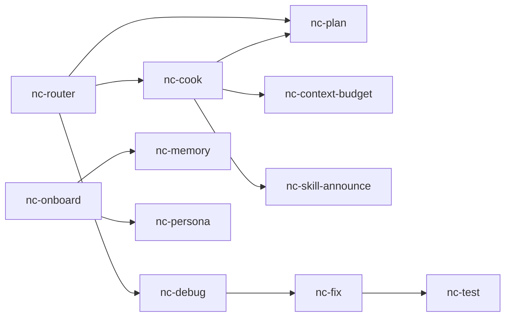

# NEXTCORE Skill Dependency Graph

**Status:** Draft v0.1 (targeting v3.0.0)
**Goal:** Make skill dependencies explicit, visualizable, and CI-checkable. Detect circulars early.

---

## Frontmatter convention

```yaml
---
name: nc:cook
description: "..."
license: MIT
depends_on:
  - nc-plan       # consumes plan output
  - nc-context-budget  # respects budget
  - nc-skill-announce  # announces invocation
suggests:
  - nc-test       # often follows
  - nc-fix        # if cook reveals bugs
---
```

| Field | Meaning |
|---|---|
| `depends_on` | Skills this skill READS / requires output from |
| `suggests` | Skills typically invoked AFTER, but not required |

`Integration:` section in body is the human-readable companion. Frontmatter is the machine-readable index.

## Generation

```bash
node scripts/skills-deps-graph.cjs                    # outputs Mermaid
node scripts/skills-deps-graph.cjs --format=dot       # Graphviz DOT
node scripts/skills-deps-graph.cjs --skill nc-cook    # subgraph from one skill
node scripts/skills-deps-graph.cjs --check-circular   # exit 1 if cycle exists
```

Output saved to `docs/skills-graph.md` (Mermaid renders inline on GitHub).

## Mermaid sample output



## Catalog integration

`catalog.json` per-skill record gets:

```json
{
  "name": "nc-cook",
  "description": "...",
  "depends_on": ["nc-plan", "nc-context-budget", "nc-skill-announce"],
  "suggests": ["nc-test", "nc-fix"]
}
```

`catalog.html` shows dependencies inline as a column or expandable detail.

## CI check (no circular deps)

`scripts/skills-deps-graph.cjs --check-circular`:

1. Parse all SKILL.md frontmatter for `depends_on`
2. Build directed graph
3. Detect cycles (Tarjan's SCC)
4. Exit 1 with cycle path printed if any found
5. Exit 0 if clean

Add to PR CI: prevents accidentally introducing `A → B → A`.

## Validator integration

`scripts/validate-skills.cjs` extends:
- Warning if `depends_on` list contains skills that don't exist
- Warning if `Integration` body section mentions skills NOT in `depends_on` (out of sync)

## Use cases

1. **Discovery** — "I'm using nc-cook, what else fits the workflow?" → look at `suggests`
2. **Impact analysis** — "If I deprecate nc-X, who breaks?" → reverse-graph traversal
3. **Onboarding** — new contributor sees skill ecosystem visually
4. **Migration planning** — when reorganizing skill names, track all references
5. **Test generation** — circular check in CI prevents broken state

## Migration

Existing skills lack the frontmatter fields. Opportunistic adoption:
- v3.0.0: spec + script ship
- v3.0.x patches: each touched skill adds the fields
- v3.1.0 target: 80%+ skills declared
- v3.2.0: validator escalates "missing depends_on" from warning to error

## Anti-patterns

- Listing every skill mentioned in body (overwhelms graph; only true deps)
- `depends_on: [everything]` — cargo-culting
- Silent suggest ("kind of related") — be intentional
- Forgetting to update on rename (validator catches)
- Circular convenience deps (e.g., `nc-router depends on nc-cook depends on nc-router`)

## Open questions

- Versioned deps? `depends_on: ["nc-plan@>=2.0"]` — lean toward NO (skills are not packages)
- Optional deps? Currently `suggests` covers it; revisit if pattern emerges
- Cross-IDE skills with different deps? Currently uniform; flag if needed

## Status

Spec ready. Script `scripts/skills-deps-graph.cjs` ships v3.0.0. Frontmatter adoption opportunistic.
